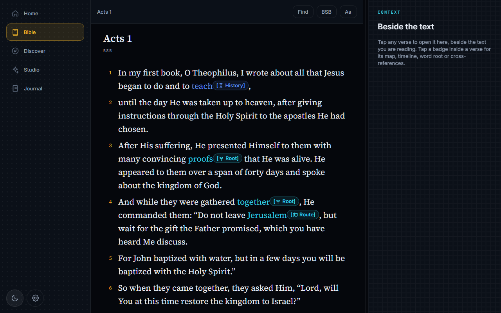
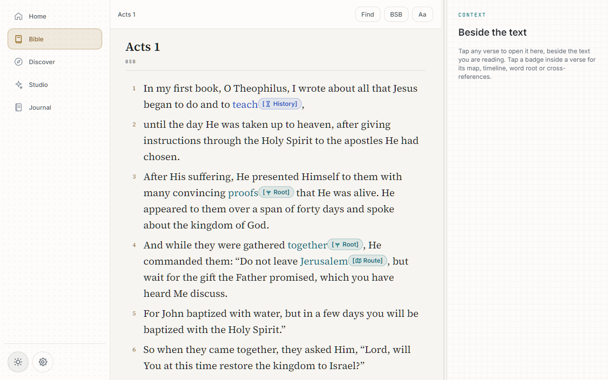
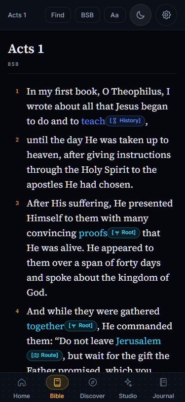
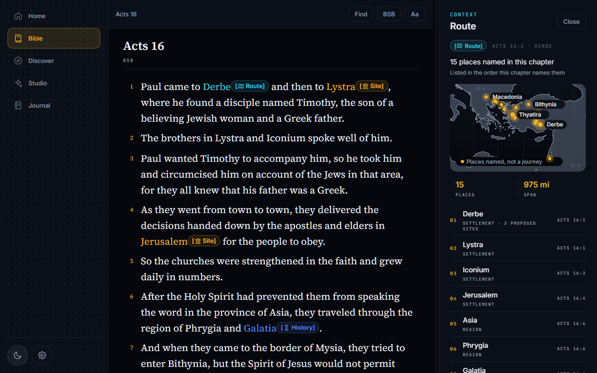
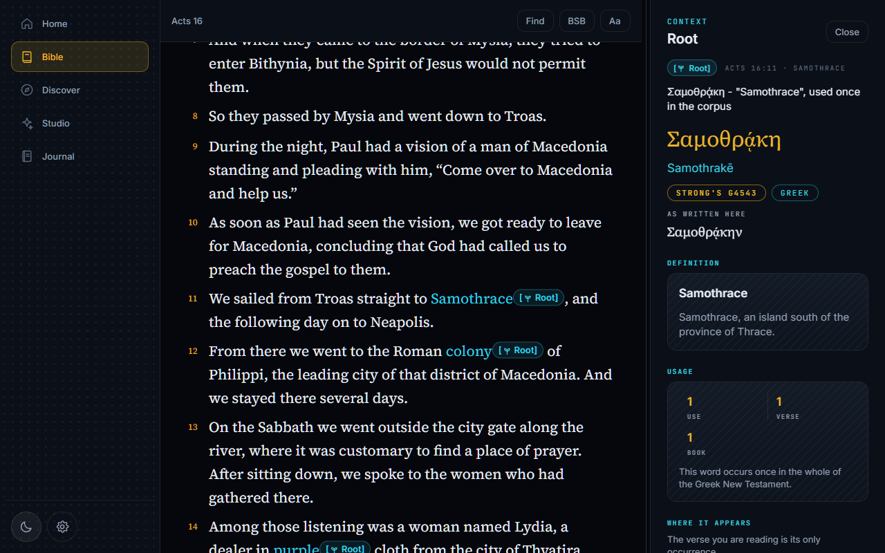
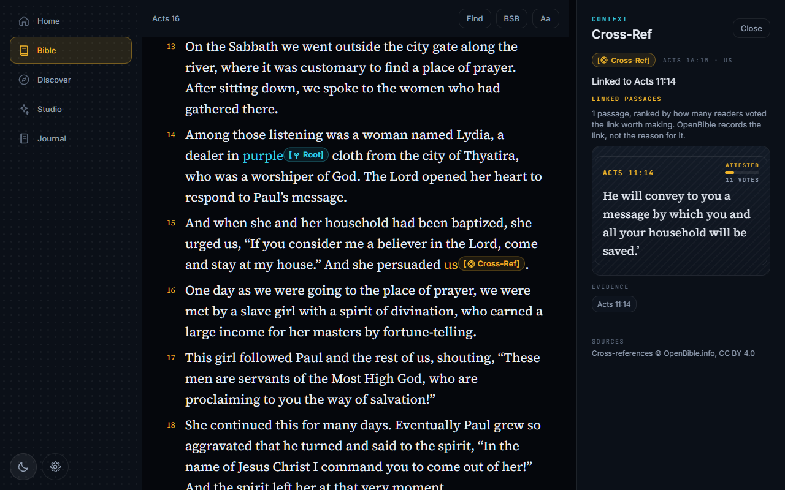
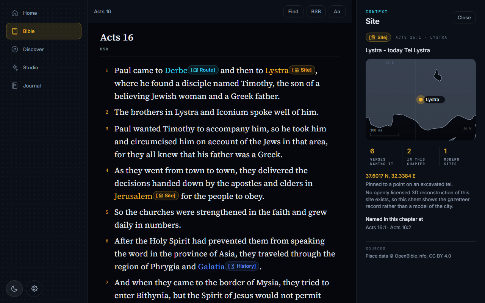

# Atlas Bible

> **See the Context. Hear the Voice. Live the Word.**

A multimodal Bible atlas. Scripture is an interactive canvas: small pills sit *inside* the
verse text, and tapping one opens a focused sheet with a map, a Greek or Hebrew root, a
manuscript variant, a historical timeline, or cross-references. Context arrives where the
reader already is, instead of sending them to another app.

Codename *Aletheia* — ancient Greek ἀλήθεια, "unveiling reality".



---

## Contents

1. [Start here](#1--start-here)
2. [Prerequisites](#2--prerequisites)
3. [What works today](#3--what-works-today)
4. [What is in progress](#4--what-is-in-progress)
5. [The plan](#5--the-plan)
6. [How this project works](#6--how-this-project-works)
7. [Architecture](#7--architecture)
8. [Documentation index](#8--documentation-index)
9. [Reports and evidence](#9--reports-and-evidence)
10. [Rules that are not negotiable](#10--rules-that-are-not-negotiable)
11. [Traps already paid for](#11--traps-already-paid-for)

New here? Read **[HANDOFF.md](HANDOFF.md)** first — it is the fastest path to being useful.
If you are an AI agent, read **[CLAUDE.md](CLAUDE.md)** and
**[docs/decisions/DECISIONS.md](docs/decisions/DECISIONS.md)** before writing a line.

---

## 1 · Start here

```bash
pnpm install
docker compose up -d          # Postgres+pgvector on :5436, API on :8010
pnpm db:seed                  # loads scripture — idempotent, safe to re-run
pnpm web                      # Expo web build
```

Confirm it is alive:

```bash
curl http://localhost:8010/ready
curl "http://localhost:8010/chapters/BSB/acts/16"
curl "http://localhost:8010/badges/chapters/BSB/acts/16"
```

Quality gates:

```bash
pnpm typecheck && pnpm lint && pnpm test          # TypeScript — 1,799 tests
docker compose run --rm api pytest -q              # Python — 342 tests
pnpm walkthrough                                   # the real UI in real Chrome — 237 steps
```

Everything else:

| Command | What it does |
|---|---|
| `pnpm dev` | Expo dev server (all platforms) |
| `pnpm android` | Android device or emulator |
| `pnpm db:verify` | Assert scripture row counts |
| `pnpm test:watch` | Vitest in watch mode |
| `pnpm format` | Prettier across the repo |
| `node tools/question-hub/server.mjs` | The Question Hub (see §6) |

---

## 2 · Prerequisites

Install these before anything else. Versions are what the project was built and verified on.

| Tool | Version | Why | Notes |
|---|---|---|---|
| **Node.js** | 25.x | Client, tooling, Question Hub | 20+ probably fine; 25 is verified |
| **pnpm** | 10.x | Package manager | `npm i -g pnpm`. **Do not use npm or yarn** — the lockfile and `node-linker=hoisted` matter |
| **Docker Desktop** | 29.x | Postgres + pgvector + API | Must be **running** before `docker compose up` |
| **Python** | 3.12 | Backend, ingest scripts | Only needed to run the API outside Docker |
| **Google Chrome** | any recent | The walkthrough suite | Playwright uses `channel: 'chrome'` — **never run `npx playwright install`**, it downloads a browser |
| **Git** | 2.x | — | — |

**Android (optional):** Android Studio + an emulator or a device with USB debugging.
This is an **Expo development build**, not Expo Go — `react-native-mmkv` needs native code.

**Ports used:** `8010` API · `5436` Postgres · `8081` Expo · `7777` Question Hub.
Deliberately offset from the defaults so the old prototype can run alongside.

**No API keys are required** to run the app. Scripture, badges and maps are all served from
open data with no third-party service. Keys are only needed for the AI features, which are
not yet wired into the client — copy `.env.example` to `.env` when you get there.

---

## 3 · What works today

### The reading canvas

**124,372 verses** across four openly-licensed translations — KJV, ASV, BSB, WEB.
**No ESV**: it appears in the product mockups but is licensed, and must not ship without an
agreement with Crossway.

Verse selection, a translation switcher, a reference picker across all 66 books, full-text
search, light and dark themes, and phone / tablet / desktop layouts including a resizable
context rail.

| | |
|---|---|
|  |  |

### The badge system

Five badge types render inline in scripture and open sheets backed by real sourced data.
Every sheet shows its source and licence — **a badge with no provenance does not render.**

| Badge | What it shows | Source |
|---|---|---|
| **Route** | Places named in a chapter, on a drawn map | OpenBible.info, CC BY 4.0 |
| **Site** | A place, its significance and coordinates | OpenBible.info, CC BY 4.0 |
| **History** | Dual-axis timeline of rulers and events | Wikidata |
| **Root** | Greek/Hebrew lemma, Strong's number, usage | STEPBible TAGNT/TAHOT, CC BY 4.0 |
| **Cross-Ref** | Linked passages with their text, ranked | OpenBible.info |

Maps are drawn from GeoJSON. **No tile provider, no Mapbox token, no API key.**

| | |
|---|---|
|  |  |
|  |  |

### Data loaded — measured, not estimated

| Table | Rows |
|---|---|
| `cross_references` | 344,799 |
| `verse_words` | 142,096 |
| `verses` | 124,372 |
| `lexicon` | 19,714 |
| `structure_nodes` | 10,085 |
| `place_mentions` | 8,742 |
| `places` | 1,342 |
| `routes` | 682 |
| `rulers` | 43 |

All from open datasets with verified licences. Every payload in `data/raw/` carries a
`PROVENANCE.md` with source URL, licence text, retrieval date, checksums and row counts.
Payloads are gitignored; provenance files are not.

### Test position

**1,799 TypeScript tests · 342 Python tests · a 237-step UI walkthrough** across three
viewports in both themes. Latest full run: **202 passed, 0 failed, 35 skipped.**

---

## 4 · What is in progress

A quality pass was running when this was handed off and **was stopped deliberately, mid-flight,
after its second repair round**. The tree is coherent — typecheck, lint, and all tests pass —
but the following were still being worked and are **not finished**:

| Item | State |
|---|---|
| **Route badge claims** | The badge lists places a chapter names, in mention order. Work was in flight to guarantee every listed place is genuinely named in that chapter's text. A pillar-3 concern — see §10. |
| **Place display names** | Migration `0008_place_display_names` removes OpenBible's internal homonym ordinal from names shown to readers. Landed, but not independently re-verified. |
| **Inland site maps** | An inland location (e.g. Lystra) renders as a sparse grid with stray coastline fragments. It reads as a bug, not a map. Partially addressed. |
| **Route map polyline** | A line joining pins implies a journey. Where the data only supports "these places are named here", that is a false claim in graphical form. Under review. |
| **Widened walkthrough** | Grew from 153 to 237 steps (Hebrew RTL, Psalm 119, Genesis 1, single-chapter books, empty states, all four translations). 35 steps are **skipped** — check why before trusting the number. |

The **35 skipped walkthrough steps** are the first thing to look at. A skip is not a pass.

---

## 5 · The plan

Full detail in **[docs/ROADMAP.md](docs/ROADMAP.md)** — twelve milestones, sequenced so the
riskiest thing is proven earliest rather than the easiest shipped first.

| Milestone | State |
|---|---|
| M0 · Prove the inline badge renders inside flowing text | ✅ Done — the spike that could have killed the product |
| M1 · The reading canvas on real scripture | ✅ Done |
| M2 · The badge system end to end | ✅ Done, quality pass incomplete |
| M3 · Grounded chat (Studio tab) | ⬜ Next |
| M4 · The habit loop — streaks, daily drop, notifications | ⬜ |
| M5 · Journal — end-to-end encrypted, syncing | ⬜ |
| M6 · Remaining badges — Manuscript, Lineage, Cultural | ⬜ |
| M7 · Discover tab — 3D map and timeline explorer | ⬜ |
| M8 · Audio — player UI (stubs by decision `AU-01`) | ⬜ |
| M9 · Production hardening | ⬜ |

**M3 is the recommended next step.** Retrieval over pgvector with *structural* citations:
every sentence carries a source anchor or is not shown. `packages/ai-guard` and the SSE
streaming client are already built and tested for it.

Two badges have **no open dataset and cannot get one**: 3D City (renamed `[Site]` for exactly
that reason) and Meditate. Both negatives are documented so nobody searches again.

---

## 6 · How this project works

Three things here are unusual. Understanding them will save a lot of confusion.

### The Question Hub — run it on your phone

> **The product owner explicitly recommends this. It is the single practice that made the
> project work, and they asked that it be passed on.**

`tools/question-hub/` is a zero-dependency Node service that binds to `0.0.0.0:7777` and is
reachable from any device on the same WiFi. The owner answered **104 questions from their
phone**, in short bursts, while the build continued without them.

```bash
node tools/question-hub/server.mjs
# prints every LAN address it is reachable on, e.g. http://192.168.0.102:7777
```

Then open that address on your phone. The UI is built for one-handed use: multiple-choice
with an "Other" free-text escape, reference images inline, per-section "accept all
recommendations", and keyboard shortcuts on desktop.

**Why it matters.** A long build generates dozens of decisions only the owner can make.
Asking them one at a time in a chat serialises the entire project against one person's
attention. This decouples the two: agents queue questions and keep building on a recorded
default; answers arrive whenever the owner has a spare minute. Nothing blocks.

```bash
node tools/question-hub/answers.mjs --all    # read every decision
node tools/question-hub/ask.mjs --help       # queue a question (agents)
```

Answers live in `tools/question-hub/data/` — **gitignored, so they exist only on the owner's
machine.** The committed snapshot is `docs/decisions/ANSWERS.md`.

### The walkthrough loop is the definition of done

"Tests pass" is not the bar. The bar is: design a high-coverage walkthrough, run it against
the real UI in a real browser, find bugs, fix them, repeat until a full pass is clean.

```bash
pnpm walkthrough
```

It drives the Expo **web** build through installed Chrome at phone, tablet and desktop, in
both themes, capturing a screenshot at every step into `docs/qa/walkthroughs/<run>/`.

**Look at the screenshots.** Every serious bug in this repo's history was found by a human
or agent looking at an image, not by a red test: an entire tablet breakpoint band silently
getting the phone layout, a sheet that opened but showed only a teaser, a map that rendered
as an abstract shape.

### The decision log outranks your judgement

**[docs/decisions/DECISIONS.md](docs/decisions/DECISIONS.md)** — if it contradicts what you
were about to build, **it wins**. It records the 26 places the owner overrode a
recommendation, four resolved conflicts, and the findings that overturned earlier plans.

The overrides most often rebuilt wrong from memory:

1. **Web is first-class**, not a testing convenience. Never import a native-only module
   (`react-native-mmkv`) from shared code — it has no web build.
2. **Full phone / tablet / desktop parity.**
3. **Data syncs across devices** — streaks, journal, flashcards.
4. **The journal is end-to-end encrypted.** The server holds ciphertext and can never read
   or index an entry.
5. **Light mode actually ships.**
6. **A day completes on opening and reading** — not the spec's three-step loop.
7. **Never redistribute the database.** Enrichment is server-delivered; that is what keeps
   the share-alike licences from triggering.
8. **A CHANGELOG entry and version bump for every change.**

---

## 7 · Architecture

```
apps/
  api/                    FastAPI, four layers, Alembic, pgvector
    app/modules/          scripture · badges · identity · study · retrieval · health
      <module>/domain/          entities and rules — imports no infrastructure
      <module>/application/     use cases and port interfaces
      <module>/infrastructure/  Postgres repositories
      <module>/presentation/    routers and schemas
    scripts/              idempotent ingest loaders, counts asserted
    db/versions/          Alembic migrations
  mobile/                 Expo SDK 57, RN 0.86, React 19, Expo Router
    app/                  file-based routes — (tabs), read/[book]/[chapter]
    src/features/         reader · sheets (spatial, textual) · badges
    src/theme/            typed design tokens, WCAG contrast tests
    src/api/              typed client, TanStack Query, SSE streaming
packages/
  shared/                 66 books, verse keys, badge types — pure TS, no React
  ai-guard/               model registry, spend ceiling, disk cache
tools/question-hub/       the async decision channel
e2e/                      the walkthrough suite
data/raw/                 acquired datasets (gitignored) + PROVENANCE.md (committed)
docs/                     everything in §8
```

**Stack:** Expo SDK 57 · React Native 0.86 · React 19 · TypeScript 6 (strict) ·
Expo Router · Zustand · TanStack Query · FastAPI · PostgreSQL 16 + pgvector · Alembic ·
Vitest · pytest · Playwright.

**Layering rule:** dependencies flow inward only. The domain layer imports nothing from
infrastructure. Enforced by tests that parse the AST, not by convention.

---

## 8 · Documentation index

| Document | What it answers |
|---|---|
| **[HANDOFF.md](HANDOFF.md)** | **Start here.** Fastest path to being useful |
| [CLAUDE.md](CLAUDE.md) | The engineering constitution — read before writing code |
| [CHANGELOG.md](CHANGELOG.md) | Every change, newest first |
| [.claude/rules/](.claude/rules/) | Ten mandatory code rules + a review checklist |
| [docs/decisions/DECISIONS.md](docs/decisions/DECISIONS.md) | What was decided and why |
| [docs/decisions/ANSWERS.md](docs/decisions/ANSWERS.md) | All 104 raw answers |
| [docs/decisions/ASSUMPTIONS.md](docs/decisions/ASSUMPTIONS.md) | Calls taken without an answer |
| [docs/decisions/MERGING-COLLEAGUE-BRANCH.md](docs/decisions/MERGING-COLLEAGUE-BRANCH.md) | **Parallel work on another branch that merges clean but does not compile — read before merging it** |
| [docs/ROADMAP.md](docs/ROADMAP.md) | Twelve milestones, riskiest first |
| [docs/DEVELOPMENT.md](docs/DEVELOPMENT.md) | Local dev, database reset, troubleshooting |
| [docs/product/prd.md](docs/product/prd.md) | The product spec |
| [docs/product/design-language.md](docs/product/design-language.md) | Colour, type, the inline badge, motion |
| [docs/product/mockups/](docs/product/mockups/) | Twelve reference mockups |
| [docs/architecture/flutter-port-map.md](docs/architecture/flutter-port-map.md) | The app being replaced — 23 endpoints, 11 ranked risks. **§7 is essential reading for the reader** |
| [docs/architecture/dataset-validation.md](docs/architecture/dataset-validation.md) | Every dataset, verified live, with licences and traps |
| [docs/architecture/data-inventory.md](docs/architecture/data-inventory.md) | What the prototype had; the proposed schema |
| [docs/architecture/ai-model-strategy.md](docs/architecture/ai-model-strategy.md) | Model choice and cost — measured, not recalled |
| [docs/architecture/spike-inline-badges.md](docs/architecture/spike-inline-badges.md) | How a pill renders inside flowing text |
| [docs/architecture/spike-sse.md](docs/architecture/spike-sse.md) | Streaming in React Native |
| [docs/architecture/ingest-openbible.md](docs/architecture/ingest-openbible.md) | Places and cross-references |
| [docs/architecture/original-language-ingest.md](docs/architecture/original-language-ingest.md) | Greek and Hebrew |
| [docs/architecture/history-and-structure-ingest.md](docs/architecture/history-and-structure-ingest.md) | Rulers and literary structure |
| [docs/architecture/hub-platform.md](docs/architecture/hub-platform.md) | The Question Hub's design |
| [docs/qa/WALKTHROUGH.md](docs/qa/WALKTHROUGH.md) | What the walkthrough covers, and what it does not |
| [apps/api/README.md](apps/api/README.md) | The API in detail |
| [tools/question-hub/README.md](tools/question-hub/README.md) | The hub's API and question schema |

---

## 9 · Reports and evidence

| Artefact | Where |
|---|---|
| **Curated screenshots** | [`docs/qa/showcase/`](docs/qa/showcase/) — ten images, committed |
| **Walkthrough results** | `docs/qa/walkthroughs/<run>/RESULTS.md` — every run's pass/fail, committed |
| **Full screenshots** | `docs/qa/walkthroughs/<run>/<viewport>/<chapter>/` — **gitignored** (1.1 GB across 27 runs). Regenerate with `pnpm walkthrough` |
| **Question Hub UI** | `node tools/question-hub/server.mjs`, then open the printed LAN address |
| **API docs** | `http://localhost:8010/docs` — FastAPI's interactive OpenAPI once running |

Screenshots are deliberately not committed: they are a **regenerable** artefact and would
have added over a gigabyte to the repository. The `RESULTS.md` files — the actual evidence
of what passed and failed — are committed for every run.

---

## 10 · Rules that are not negotiable

- `A:\Work\spark\spark-app` and `A:\Work\gt\ControlSight` are **read-only**. Never write there.
- **Install packages, never software.**
- **AI budget is roughly $4.50 on one OpenRouter key**, with a **$2 hard ceiling enforced in
  code** (`packages/ai-guard`). Every model call goes through the guard and its disk cache;
  no feature code calls a provider directly. A test proves a 10,000-call loop halts at the
  ceiling, that cache hits cost zero, and that retries never double-charge.
- **Pillar 3 — zero hallucination — is enforced structurally.** A claim without a citation is
  not rendered. Treat a false claim as more serious than a crash: a crash is visible, a false
  claim is believed.
- No file over 300 lines. No function over 50. No `any`. No raw colour, size or spacing
  literals in components — always a design token.
- **Never weaken a test or an assertion to make something pass.** If a test is genuinely
  wrong, fix it and say so.
- Never commit a secret. Only `.env.example` is tracked, and every key field in it is empty.

---

## 11 · Traps already paid for

Each of these cost real time. Written down so they cost you none.

| Trap | What happens |
|---|---|
| **OpenBible `ancient.jsonl` has no coordinates** | They live in `modern.jsonl`, joined on id, and `lonlat` is **longitude-first**. Get it wrong and everything lands in the wrong hemisphere. |
| **Ordering route stops by verse renders journeys backwards** | Acts 16:11 names Troas, Samothrace *and* Neapolis in one verse. Stops are ordered by position within the verse text. |
| **Translations disagree on place spellings** | BSB has "an Adramyttian ship" where KJV has "a ship of Adramyttium". Pruning waypoints against one translation deletes pins for readers of another. |
| **The prototype maps only 3 of 66 books** | A note outside Proverbs/Matthew/Ruth stored `book_number: 0`. Fixed here with all 66 round-trip tested. Do not port that code. |
| **The prototype's RAG scores are wrong** | Chroma persisted with `l2` while the code computed `1.0 - distance` as if cosine. |
| **The prototype has no real auth** | Every `/me/*` route resolved to the literal string `dev-user`. Do not port the stub. |
| **`react-native-mmkv` has no web build** | Web is first-class. Importing it from shared code breaks `pnpm web`. |
| **Alembic multi-head** | Two agents branched the same migration in one afternoon and `alembic upgrade head` failed outright, taking the API with it. `test_schema.py` now computes the head and fails if there is more than one. |
| **The mockup palette fails WCAG AA** | `ink.tertiary` measures 3.36:1 on card backgrounds. Small metadata uses `ink.secondary`. Locked by a contrast test. |
| **Colour emoji cannot be tinted** | Badge glyphs are monochrome vector paths. And `backgroundColor` on a nested `<Text>` is square on **every** platform, iOS included — the port map was wrong about iOS. |
| **`/api/v1/credits` settles asynchronously** | Up to a minute late. The spend guard meters on each response's `usage.cost`; a guard polling credits can be raced through its ceiling. |
| **Models must never emit coordinates** | The best extractor still averaged 41 km error. Models emit place *names*; code resolves them against the gazetteer. |
| **`pnpm install` prints "Packages: -26" every run** | Cosmetic, from the hoisted linker. The lockfile does not change. Do not chase it. |

---

## Licence and attribution

Scripture and enrichment data come from openly-licensed sources, each recorded in a
`PROVENANCE.md` beside the payload in `data/raw/`. Attribution is shown in the app on every
badge sheet, as the licences require.

**The database is never redistributed** — that is a deliberate architectural decision
(`Q-007`) which keeps share-alike obligations from propagating into the app.
